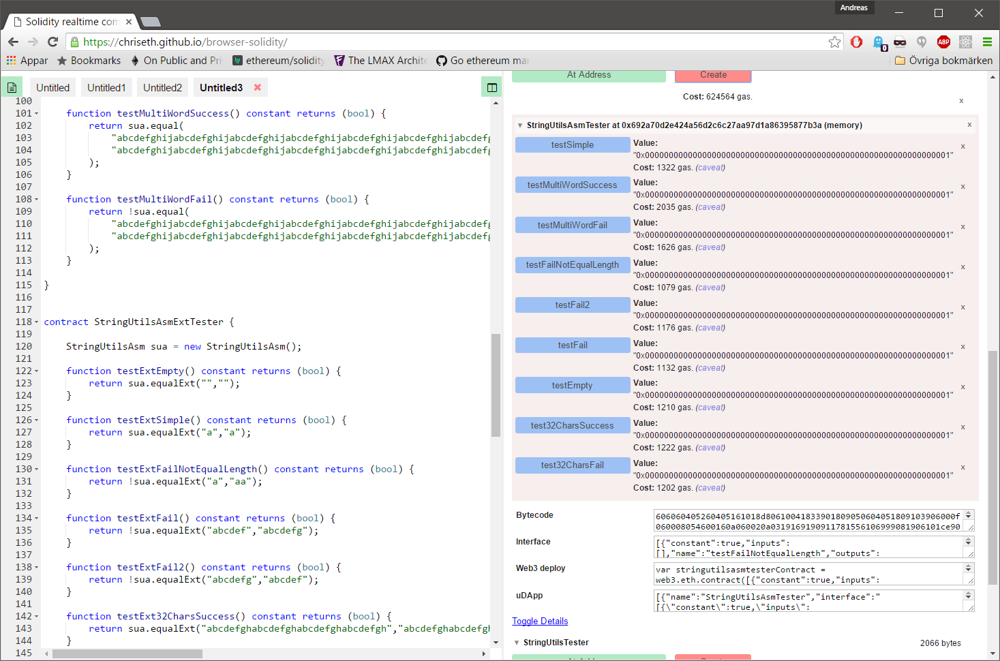
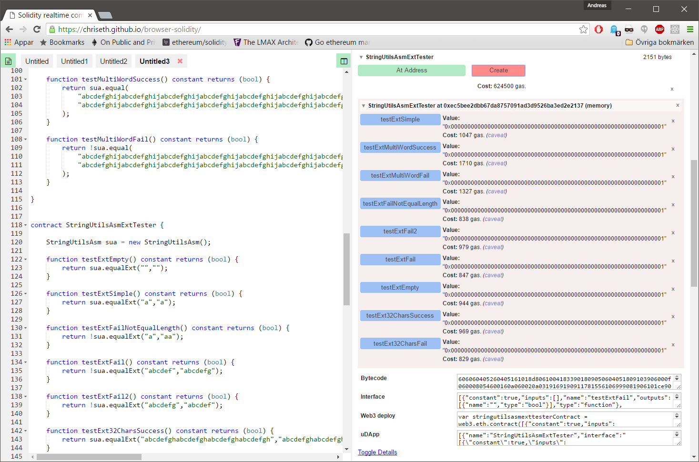
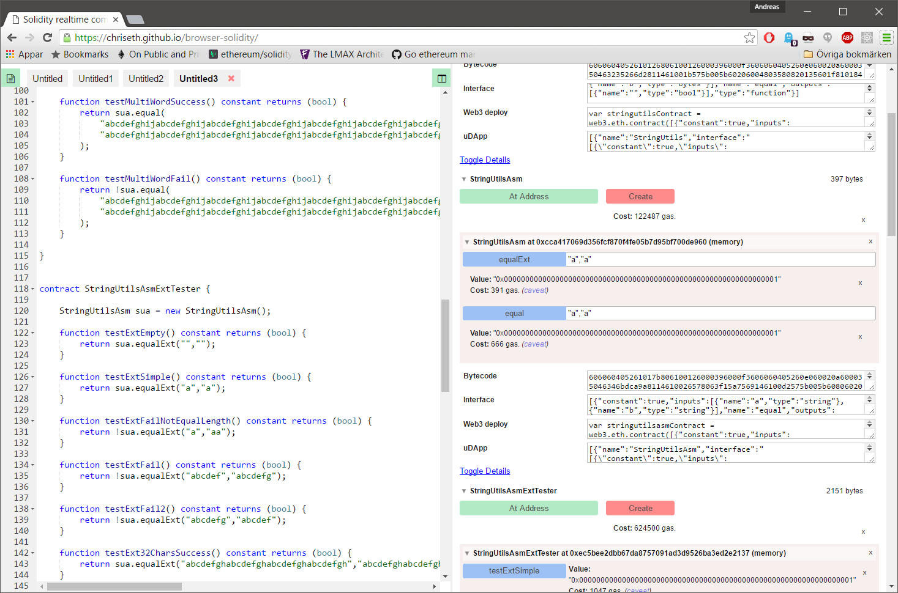
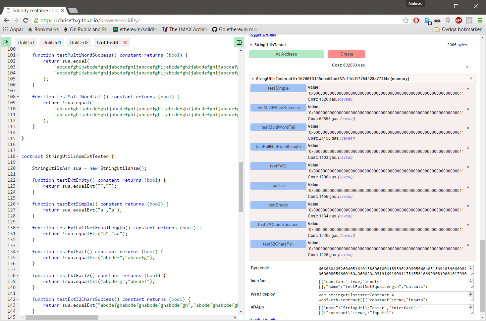

# String assembly demo

In this post I will show an example of how Solidity's new inline assembly can be used to create more efficient contracts. The example contract is very simple; it has two functions that can be called to check if two strings are equal.

The two functions here do the same thing; the only difference is that one reads the strings directly from the transaction data, and the other works with them through their solidity variables. The first alternative is less idiomatic, but slightly more efficient.

Here is the code:

```
contract StringUtilsAsm {

    // External reads strings directly from calldata ('a' and 'b' are pointers to calldata).
    function equalExt(string a, string b) constant external returns (bool) {
        uint lA;
        uint posA;
        uint lB;
        uint posB;
        assembly {
                let res := 0
                a =: lA =: posA
                b =: lB =: posB
                jumpi(tag_compare, eq(lA, lB)) // Compare byte-for-byte if length is equal, otherwise return false.
            tag_finalize:
                mstore(0x0, res)
                return(0x0, 32)
            tag_compare:
                {
                        let i := 0
                        let words := add(div(lA, 32), gt(mod(lA, 32), 0)) // Total number of words. Basically: ceil(lengthOfA / 32)
                    tag_loop:
                        {
                            let offset := mul(i, 32)
                            i := add(i, 1)
                            res := eq(calldataload(add(posA, offset)), calldataload(add(posB, offset)))
                        }
                        jumpi(tag_loop, and(lt(i, words), res) ) // Continue to loop when string-segments are equal, and 'i < words'
                }
                jump(tag_finalize)
        }
    }

    // Reads strings from memory ('a' and 'b' are pointers to memory).
    function equal(string a, string b) constant returns (bool) {
        assembly {
                let res := 0
                let lA := mload(a)   // lA address is 0x60
                let lB := mload(b)
                jumpi(tag_compare, eq(lA, lB))
            tag_finalize:
                mstore(0x0, res)
                return(0x0, 32)
            tag_compare:
                {
                        let i := 0
                        let words := add(div(lA, 32), gt(mod(lA, 32), 0)) // Total number of words. Basically: ceil(lengthOfA / 32)
                        let offsetA := add(a, 32)
                        let offsetB := add(b, 32)
                    tag_loop:
                        {
                            let offset := mul(i, 32)
                            i := add(i, 1)
                            res := eq(mload(add(offsetA, offset)), mload(add(offsetB, offset)))
                        }
                        jumpi(tag_loop, and(lt(i, words), res) )
                }
                jump(tag_finalize)
        }
    }
}
```

This is a few test contracts. It is possible to paste the above contract into browser Solidity, then paste the following two contracts and run them to see that it works, and get the gas estmates for each function.

```
contract StringUtilsAsmTester {

    StringUtilsAsm sua = new StringUtilsAsm();

    function testEmpty() constant returns (bool) {
        return sua.equal("","");
    }

    function testSimple() constant returns (bool) {
        return sua.equal("a","a");
    }

    function testFailNotEqualLength() constant returns (bool) {
        return !sua.equal("a","aa");
    }

    function testFail() constant returns (bool) {
        return !sua.equal("abcdef","abcdefg");
    }

    function testFail2() constant returns (bool) {
        return !sua.equal("abcdefg","abcdef");
    }

    function test32CharsSuccess() constant returns (bool) {
        return sua.equal("abcdefghabcdefghabcdefghabcdefgh","abcdefghabcdefghabcdefghabcdefgh");
    }

    function test32CharsFail() constant returns (bool) {
        return !sua.equal("abcdefghabcdefghabcdefgh","abcdefghabcdqfghabcdefghabcdefgh");
    }

    function testMultiWordSuccess() constant returns (bool) {
        return sua.equal(
            "abcdefghijabcdefghijabcdefghijabcdefghijabcdefghijabcdefghijabcdefghijabcdefghijabcdefghijabcdefghijabcdefghijabcdefghijabcdefghijabcdefghijabcdefghijabcdefghijabcdefghijabcdefghijabcdefghijabcdefghijabcdefghij",
            "abcdefghijabcdefghijabcdefghijabcdefghijabcdefghijabcdefghijabcdefghijabcdefghijabcdefghijabcdefghijabcdefghijabcdefghijabcdefghijabcdefghijabcdefghijabcdefghijabcdefghijabcdefghijabcdefghijabcdefghijabcdefghij"
        );
    }

    function testMultiWordFail() constant returns (bool) {
        return !sua.equal(
            "abcdefghijabcdefghijabcdefghijabcdefghijabcdefghijabcdefghijabcdefghij",
            "abcdefghijabcdefghijabcdefghijabcdefghijabcdefghijabcdefghijabcdefghir"
        );
    }

}


contract StringUtilsAsmExtTester {

    StringUtilsAsm sua = new StringUtilsAsm();

    function testExtEmpty() constant returns (bool) {
        return sua.equalExt("","");
    }

    function testExtSimple() constant returns (bool) {
        return sua.equalExt("a","a");
    }

    function testExtFailNotEqualLength() constant returns (bool) {
        return !sua.equalExt("a","aa");
    }

    function testExtFail() constant returns (bool) {
        return !sua.equalExt("abcdef","abcdefg");
    }

    function testExtFail2() constant returns (bool) {
        return !sua.equalExt("abcdefg","abcdef");
    }

    function testExt32CharsSuccess() constant returns (bool) {
        return sua.equalExt("abcdefghabcdefghabcdefghabcdefgh","abcdefghabcdefghabcdefghabcdefgh");
    }

    function testExt32CharsFail() constant returns (bool) {
        return !sua.equalExt("abcdefghabcdefghabcdefgh","abcdefghabcdqfghabcdefghabcdefgh");
    }

    function testExtMultiWordSuccess() constant returns (bool) {
        return sua.equalExt(
            "abcdefghijabcdefghijabcdefghijabcdefghijabcdefghijabcdefghijabcdefghijabcdefghijabcdefghijabcdefghijabcdefghijabcdefghijabcdefghijabcdefghijabcdefghijabcdefghijabcdefghijabcdefghijabcdefghijabcdefghijabcdefghij",
            "abcdefghijabcdefghijabcdefghijabcdefghijabcdefghijabcdefghijabcdefghijabcdefghijabcdefghijabcdefghijabcdefghijabcdefghijabcdefghijabcdefghijabcdefghijabcdefghijabcdefghijabcdefghijabcdefghijabcdefghijabcdefghij"
        );
    }

    function testExtMultiWordFail() constant returns (bool) {
        return !sua.equalExt(
            "abcdefghijabcdefghijabcdefghijabcdefghijabcdefghijabcdefghijabcdefghij",
            "abcdefghijabcdefghijabcdefghijabcdefghijabcdefghijabcdefghijabcdefghir"
        );
    }

}
```

This is what I get when optimizing the contracts and then creating them.

StringUtilsAsmTester:


StringUtilsAsmExtTester:


Note that much of the gas cost is for calling the function from another contract, which is of course how it normally would be called (nobody would call a smart contract from Go or JavaScript only to compare strings).

This is the cost when calling directly:



Now a comparison with a regular, non-assembly contract. Note that this even use bytes directly, and not strings, because if strings are used they first need to be converted to bytes because there is no support for index access yet.

```
contract StringUtils {

    /// @dev Compares two strings and returns true iff they are equal.
    function equal(bytes a, bytes b) constant returns (bool) {
        uint length = a.length;
        if (b.length != a.length) {
            return false;
        }
        for (uint i = 0; i < length; i ++) {
            if (a[i] != b[i])
                return false;
        }
        return true;
    }

}


contract StringUtilsTester {

    StringUtils sua = new StringUtils();

    function testEmpty() constant returns (bool) {
        return sua.equal("","");
    }

    function testSimple() constant returns (bool) {
        return sua.equal("a","a");
    }

    function testFailNotEqualLength() constant returns (bool) {
        return !sua.equal("a","aa");
    }

    function testFail() constant returns (bool) {
        return !sua.equal("abcdef","abcdefg");
    }

    function testFail2() constant returns (bool) {
        return !sua.equal("abcdefg","abcdef");
    }

    function test32CharsSuccess() constant returns (bool) {
        return sua.equal("abcdefghabcdefghabcdefghabcdefgh","abcdefghabcdefghabcdefghabcdefgh");
    }

    function test32CharsFail() constant returns (bool) {
        return !sua.equal("abcdefghabcdefghabcdefgh","abcdefghabcdqfghabcdefghabcdefgh");
    }

    function testMultiWordSuccess() constant returns (bool) {
        return sua.equal(
            "abcdefghijabcdefghijabcdefghijabcdefghijabcdefghijabcdefghijabcdefghijabcdefghijabcdefghijabcdefghijabcdefghijabcdefghijabcdefghijabcdefghijabcdefghijabcdefghijabcdefghijabcdefghijabcdefghijabcdefghijabcdefghij",
            "abcdefghijabcdefghijabcdefghijabcdefghijabcdefghijabcdefghijabcdefghijabcdefghijabcdefghijabcdefghijabcdefghijabcdefghijabcdefghijabcdefghijabcdefghijabcdefghijabcdefghijabcdefghijabcdefghijabcdefghijabcdefghij"
        );
    }

    function testMultiWordFail() constant returns (bool) {
        return !sua.equal(
            "abcdefghijabcdefghijabcdefghijabcdefghijabcdefghijabcdefghijabcdefghij",
            "abcdefghijabcdefghijabcdefghijabcdefghijabcdefghijabcdefghijabcdefghir"
        );
    }

}
```

Here is the results:



Notice it is slightly more expensive for small strings, but balloons as the length of the string grows. In fact this could be an error in the gas estimation, because 60k is a bit over the top.

Either way, the cost is higher, and the reason is extra instructions, and much of it is because it must check byte-for-byte rather then 32 bytes at a time - which will likely be changed, meaning the benefits seen will become smaller as solidity evolves.

Finally, about the code-size: Removing one of the functions from the assembly contract will put it at about 150 bytes, while the normal Solidity contract is at about 300. This is a lot, but will of course be less when you can compare word by word in normal Solidity as well. It will be interesting to compare gas efficiency in functions where you have to compare byte-for-byte in both cases.